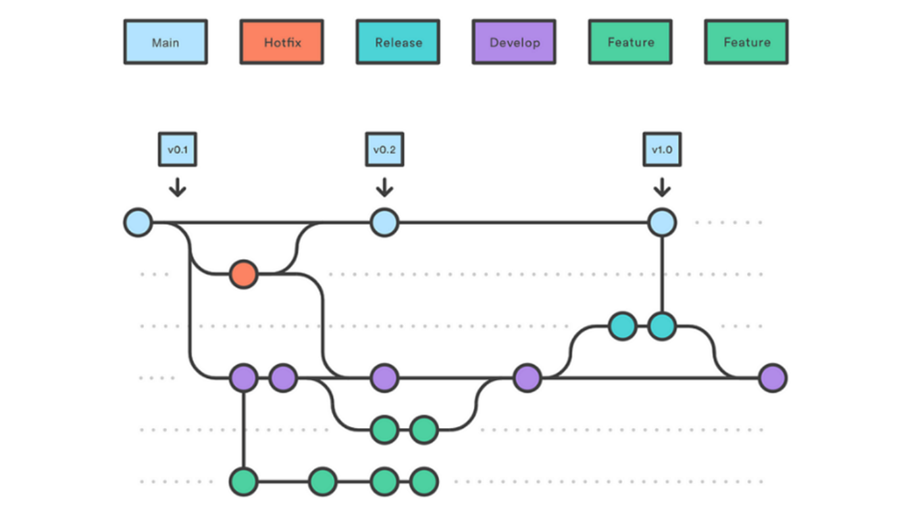

# GitFlow explained: A simple approach to complex projects

GitFlow is a structured Git branching strategy designed to streamline release management.
Introduced in 2010, it relies on long-lived primary branches and feature branches for
organised development. GitFlow's structure promotes stability and predictability,
making it well-suited for projects with scheduled releases.

## GitFlow Features:

**Main branch:**
In GitFlow, the main branch holds production-ready code, representing the gold standard for releases.
It's created at the project's outset and maintained throughout its lifespan.
Tags on specific commits within the main branch mark different versions or releases.
Only thoroughly tested and approved code from other branches gets merged into the main branch.

**Develop branch:**
The develop branch is created at the start of a project and is maintained throughout the development process,
and contains pre-production code with newly developed features that are in the process of being tested.
Newly created features should be based off the develop branch, and then merged back in when ready for testing.

**Feature branch:**
The develop branch in GitFlow is where active development happens.
It's created at the project's start and holds pre-production code with new features under testing.
Developers start feature branches from the develop branch
and merge their completed features back into it for further testing before they reach the main branch.

**Release branch:**
The release branch serves as the staging area for an upcoming production release.
It focuses on final polishing and fixing minor bugs specific to that release,ensuring a stable deployment.
Work done on the release branch avoids major changes that should instead be handled in the main develop branch.

**Hotfix branch:**
Hotfix branches provide rapid fixes for critical issues found in your production (main) branch.
They are created directly from the main branch and, once the fix is complete,
changes are merged back into both main and develop branches.
Merging into develop ensures the fix will be included in future releases, preventing the issue from reappearing.