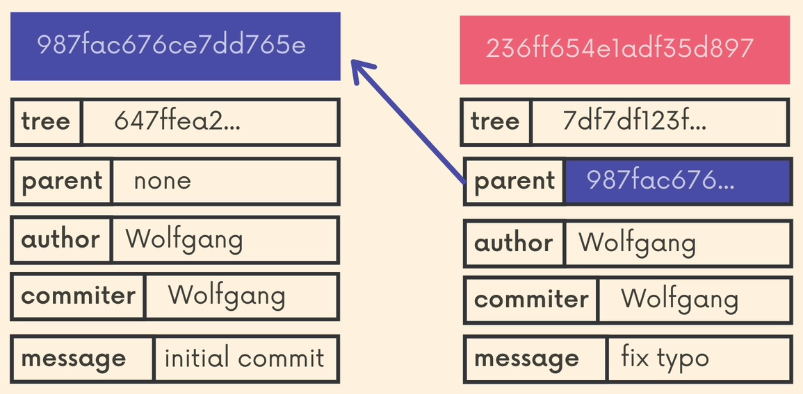
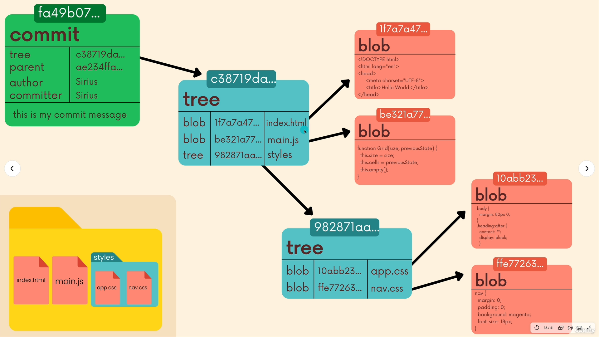

# Behind The Scenes
    
### The config file

The config file is for configuration.

`git config --global` - Configures settings globally.
<pre><code>
~/
└── .gitconfig  👈 global config lives here </code></pre>

`git config --local` - Configures settings locally in the current repo.
<pre><code>
your-project/
└── .git/
    └── config  👈 local config lives here 
</code></pre>

---

### The refs folder

Refs for references.

Inside of refs, there is a heads directory. It’s used to store references to various objects in your repository, such as branches, tags, and remote references.

Essentially, it's where Git keeps pointers to the latest commits that represent the heads of branches or the tips of your tags.

<pre><code>
.git/
└── refs/
    ├── heads/           # Local branches
    ├── tags/            # Tags
    └── remotes/         # Remote-tracking branches
</code></pre>

The refs folder is vital for Git to track and manage branches, tags, and remotes.

---

### Objects folder

Contains objects that represent your repository's history and content. This is where git stores the backups of files, the commits in a repo and more. All the files are compressed and encrypted.

<pre><code>
.git/
└── objects/
    ├── 00/
    ├── 01/
    ├── 02/
    └── ...  # Directories named by the first two characters of the object hash
    └── < sha1-hash >  # Actual object files with the remaining characters of the hash
</code></pre>

### What Are Git Objects?

**There are 4 types of git objects:**

1. Blobs - Binary Large Objects, are the object type git uses to store the contents of files in a given repository. They don’t include the name of the file or any other data, just it contents.
2. Trees - Trees are git objects used to store the contents of a directory. Each tree contains pointers that can refer to blobs and other trees. Each entry in a tree contains the SHA-1 hash of a blob or a tree, as well as the mode, type, and filename.
    
    `git cat-file -p master^{tree}` -  Shows the tree in the specified branch. 
    
3. Annotated tags - The annotated tag object include metadata, who made the tag, the dates, a tag message and it stores a reference to a commit.
4. Commits - Commit objects combine a tree object along with information about context thta led to the current tree. Commits store a reference to parent commit[s], the author, the commiter, and the commit message.

A commit object and it's parent:

`git cat-file -t hash` - Print the object type.

The objects and where are they pointing to:

### Git data base
    
Git is a key-value data store. We can insert any kind of content into a git repo, and git will hand us back a unique key we can use to retrieve that content.

These keys that we get back are SHA-1 checksums.
The objects are stored in a way that their SHA-1 hash is used as their unique identifier. This means that the content itself determines its identity, and if two repositories have the same content, they will have the same object hashes.

- `git hash-object file` - Takes some data and gives us back the unique SHA-1 hash that would be used to store the object. But it does not actually store anything.

- `git hash-object -w file` - Takes some data, stores it in our .git/objects directory and gives us back the unique SHA-1 hash that refers to that data object.

- `git cat-file -p hash` - Prints the contents of the object based on its hash.
