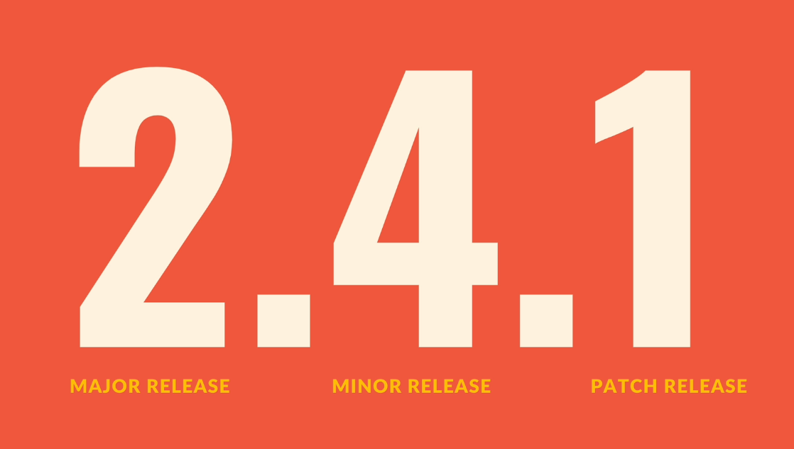

## Tags
    
Tags are pointers that refer to a particular points in git history. A tag is a label for a commit, once a tag is created it always refers to the same commit.

**There are two types of Git tags:**

**1. Lightweight tags** - They are just a label that points to a particular commit.
**2. Annotated tags** - Store extra meta data including the author’s name and email, the date, and a tagging message.

---

### Semantic Versioning

It provides a consistent way for developers to give meaning to their software releases.

Versions consist of three numbers separated by periods. 

**Patch release:**

Normally do not contain new features or significant changes. They typically signify bug fixes and other changes that don’t impact how the code is used. 
exmp: 1.0.1

**Minor release:**

Signify that new features or functionality have been added, but the project is still backwards compatible. No breaking changes. The new functionality is optional and should not force users to rewrite their own code. 
exmp: 1.1.0

**Major release:**

Signify significant changes that are no longer
backwards compatible. Features may be removed or changed substantially. 
exmp: 2.0.0

---
### Tagging commands 

`git tag` - Lists all of the tags in the current repository.

`git tag -l "*some-word*"` - Lists all the tags that include some-word in their name.

`git checkout tag` - Shows the state of a repo at a particular tag.

`git diff tag another-tag` - Shows the differences between tags.

`git tag tag-name` - Creates a lightweight tag, the tag will refer to the commit that HEAD is referring.

`git tag -a tag` - Creates an annotated tag and will open the text editor to ask you about more info, the tag will refer to the commit that HEAD is referring.

`git show tag` - Shows more information about the tag.

`git tag tag commit-hash` - Tags the specified commit.

`git tag -f tag commit-hash`   - Forces the tag through if it the tag is already referring to a commit.

`git tag -d tag` - Deletes a tag.

`git push --tags` - Transfers all of your tags to the remote server that are not already there (the git push command doesn’t transfer tags to remote servers). 