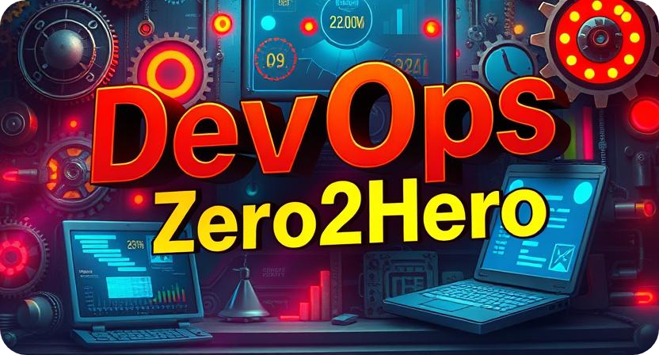

<!-- omit in toc -->
# Python Basics for DevOps

- Python is a versatile programming language widely used in DevOps for automation, scripting, and infrastructure management
- This guide covers Python fundamentals essential for DevOps practitioners
- Follow along with examples to build your Python skills for DevOps workflows

---

  

---

<!-- TOC will be generated here -->
## Table of Contents

- [Introduction to Python for DevOps](#introduction-to-python-for-devops)
- [Setting Up Python Environment](#setting-up-python-environment)
- [Python Basics](#python-basics)
  - [Variables and Data Types](#variables-and-data-types)
  - [Control Structures](#control-structures)
  - [Functions](#functions)
  - [Modules and Packages](#modules-and-packages)
- [Working with Files](#working-with-files)
- [Error Handling](#error-handling)
- [Practical Examples](#practical-examples)
- [Resources](#resources)

---

## Introduction to Python for DevOps

Python has become an essential tool in DevOps due to its simplicity, readability, and extensive library support. As a DevOps engineer, Python empowers you to:

- Automate repetitive tasks
- Manage infrastructure as code
- Parse logs and configuration files
- Create REST APIs for service integration
- Build monitoring and alerting tools

This guide will help you build the Python foundations needed for DevOps work.

## Setting Up Python Environment

[Content about setting up Python, virtual environments, package management...]

## Python Basics

### Variables and Data Types

[Content about Python variables, data types relevant to DevOps...]

### Control Structures

[Content about if statements, loops, etc...]

### Functions

[Content about functions, parameters, returns...]

### Modules and Packages

[Content about importing modules, creating packages...]

## Working with Files

[Content about file operations, which are crucial for DevOps tasks...]

## Error Handling

[Content about try/except blocks and error handling...]

## Practical Examples

[DevOps-focused Python examples like parsing logs, automating deployments...]

## Resources

[Links to useful Python for DevOps resources...]

---
